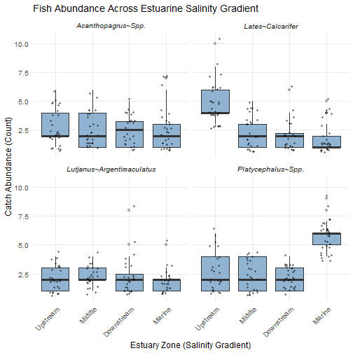

## Introduction

Keystone Exercise at the end of Workshop 2 in Module 2


``` r
# Keystone exercise: Estuary Fish Survey - Data Rescue Mission
# The Premise: You have inherited a project from a former PhD student who was studying the relationship between water quality and predatory fish assemblages along the Ross River Estuary gradient. Unfortunately, their data management was entirely manual, and the files are a disaster.
# They left you with four separate datasets:
  # estuary_catch_log.xlsx: Handwritten field counts of fish species (using common names), spread across multiple spreadsheet tabs.
  # estuary_metadata.csv: The spatial coordinates and estuary zones for each site.
  # estuary_sonde_data.csv: High-frequency water quality sensor readings.
  # species_dictionary.csv: A taxonomic lookup table linking local common names to their accepted scientific names.

# Your mission is to write a single, reproducible R script (or .qmd) that ingests this mess, cleans it, joins it into a single master dataset, and produces a publication-ready visualisation of the estuary's ecology.

# Deliverables (to include in ePortfolio report/page)
# At the end of this exercise, your final script/document must successfully output:
  # A clean master dataset containing no legacy errors (-999.0), standardised text, a complete zero-catch framework, and scientific names instead of common names.
  # A statistical summary table displaying the mean and standard deviation of fish counts and salinity for each species per zone.
  # A multi-panel plot (faceted by species) showing fish abundance along the salinity gradient, formatted to professional publication standards.

# Rules of Engagement
# Because this is an open-ended task, there is no single "correct" way to approach this and structure your code. However, think about all the data-wrangling and visualisation skills you have developed over recent weeks, and adhere to the following professional standards:
  # Monitor your AI agents: You are encouraged to use AI to help you write code. However, for every major data wrangling step, make sure you understand what is going on and are not just running AI-written code blindly.
  # Annotate your work: To help you with the above, make sure     you include comments (#) explaining what the code is doing. If you used an AI prompt to generate a complex block of code, paste your prompt as a comment above it.
  # Utilise the tidyverse: There are many ways of wrangling data, but here we are looking for you to use your growing skills in dplyr, tidyr, stringr, and lubridate functions linked by the pipe (|> or %>%).
  # Reproducible workflow: Make sure you stay on top of your PC → Git → GitHub lifecycle, by utilising: save, commit, pull, push!
```


``` r
# installing chattr

#install.packages("ellmer")
#install.packages("chattr")
#install.packages("usethis")
library(ellmer)
```

```
## Warning: package 'ellmer' was built under R version
## 4.5.3
```

``` r
library(chattr)
```

```
## Warning: package 'chattr' was built under R version
## 4.5.3
```

```
## Registered S3 methods overwritten by 'htmltools':
##   method               from         
##   print.html           tools:rstudio
##   print.shiny.tag      tools:rstudio
##   print.shiny.tag.list tools:rstudio
```

``` r
library(usethis)
```

```
## Warning: package 'usethis' was built under R version
## 4.5.3
```


``` r
# Phase 1 : Ingestion and Decontamination
# Load the four datasets

#install.packages("tidyverse")
#install.packages("readxl")
#install.packages("here")
library(tidyverse)
```

```
## Warning: package 'tidyverse' was built under R version
## 4.5.3
```

```
## Warning: package 'ggplot2' was built under R version
## 4.5.3
```

```
## Warning: package 'tibble' was built under R version
## 4.5.3
```

```
## Warning: package 'tidyr' was built under R version 4.5.3
```

```
## Warning: package 'readr' was built under R version 4.5.3
```

```
## Warning: package 'purrr' was built under R version 4.5.3
```

```
## Warning: package 'dplyr' was built under R version 4.5.3
```

```
## Warning: package 'stringr' was built under R version
## 4.5.3
```

```
## Warning: package 'forcats' was built under R version
## 4.5.3
```

```
## Warning: package 'lubridate' was built under R version
## 4.5.3
```

```
## ── Attaching core tidyverse packages ────────────────────
## ✔ dplyr     1.2.1     ✔ readr     2.2.0
## ✔ forcats   1.0.1     ✔ stringr   1.6.0
## ✔ ggplot2   4.0.3     ✔ tibble    3.3.1
## ✔ lubridate 1.9.5     ✔ tidyr     1.3.2
## ✔ purrr     1.2.2     
## ── Conflicts ─────────────────── tidyverse_conflicts() ──
## ✖ dplyr::filter() masks stats::filter()
## ✖ dplyr::lag()    masks stats::lag()
## ℹ Use the conflicted package (<http://conflicted.r-lib.org/>) to force all conflicts to become errors
```

``` r
library(readxl)
```

```
## Warning: package 'readxl' was built under R version
## 4.5.3
```

``` r
library(here)
```

```
## Warning: package 'here' was built under R version 4.5.3
```

```
## here() starts at D:/MB5370/MB5370_Module_02/Class_Repository/Exercise_R4MarineScience/R4MarineScience
```

``` r
estuary_catch_log <- read_excel(here::here("../R4MarineScience/data/workshop2/estuary_catch_log.xlsx"))
estuary_metadata <- read_csv(here::here("../R4MarineScience/data/workshop2/estuary_metadata.csv"))
```

```
## Rows: 4 Columns: 4
## ── Column specification ─────────────────────────────────
## Delimiter: ","
## chr (2): site_name, zone
## dbl (2): lat, lon
## 
## ℹ Use `spec()` to retrieve the full column specification for this data.
## ℹ Specify the column types or set `show_col_types = FALSE` to quiet this message.
```

``` r
estuary_sonde_data <- read_csv(here::here("../R4MarineScience/data/workshop2/estuary_sonde_data.csv"))
```

```
## Rows: 11520 Columns: 5
## ── Column specification ─────────────────────────────────
## Delimiter: ","
## chr (2): site, timestamp
## dbl (3): temperature, salinity, turbidity
## 
## ℹ Use `spec()` to retrieve the full column specification for this data.
## ℹ Specify the column types or set `show_col_types = FALSE` to quiet this message.
```

``` r
species_dictionary <- read_csv(here::here("../R4MarineScience/data/workshop2/species_dictionary.csv"))
```

```
## Rows: 4 Columns: 2
## ── Column specification ─────────────────────────────────
## Delimiter: ","
## chr (2): common_name, scientific_name
## 
## ℹ Use `spec()` to retrieve the full column specification for this data.
## ℹ Specify the column types or set `show_col_types = FALSE` to quiet this message.
```

``` r
glimpse(estuary_catch_log)
```

```
## Rows: 104
## Columns: 4
## $ site    <chr> "Lower_ross", "Lower_ross", "Lower_ross…
## $ date    <dttm> 2026-05-01, 2026-05-01, 2026-05-01, 20…
## $ species <chr> "barramundi", "MANGROVE JACK", "bream",…
## $ count   <dbl> 6, 3, 4, 2, 1, 1, 3, 3, 2, 3, 1, 8, 4, …
```

``` r
# columns = site, date, species, count
glimpse(estuary_metadata)
```

```
## Rows: 4
## Columns: 4
## $ site_name <chr> "Upper_Ross", "mid_ross", "LOWER ROSS…
## $ lat       <dbl> -19.31, -19.28, -19.26, -19.25
## $ lon       <dbl> 146.74, 146.78, 146.81, 146.83
## $ zone      <chr> "Upstream", "Middle", "Downstream", "…
```

``` r
# columns = site_name, lat, lon, zone - will have to change site_name to site to be able to join
glimpse(estuary_sonde_data)
```

```
## Rows: 11,520
## Columns: 5
## $ site        <chr> "upper_ross", "mid_ross", "lower_ro…
## $ timestamp   <chr> "01/05/2026 00:00", "01/05/2026 00:…
## $ temperature <dbl> 23.71379, 24.13302, 24.23558, 24.64…
## $ salinity    <dbl> 4.054812, 15.742962, 28.934938, 33.…
## $ turbidity   <dbl> 6.489046, 49.216967, 48.135752, 49.…
```

``` r
# columns = site, timestamp, temperature, salinity, turbidity
glimpse(species_dictionary)
```

```
## Rows: 4
## Columns: 2
## $ common_name     <chr> "barramundi", "mangrove_jack", …
## $ scientific_name <chr> "Lates calcarifer", "Lutjanus a…
```

``` r
# columns = common name, scientific name
```


``` r
# Excel Tab Iteration: The catch log is split across multiple tabs (one for each site). You will need to figure out how to read all tabs and bind them together into a single data frame
excel_sheets <- excel_sheets(here::here("../R4MarineScience/data/workshop2/estuary_catch_log.xlsx"))

estuary_catch_log_combined <-
  map_df(excel_sheets, ~ read_excel(here::here("../R4MarineScience/data/workshop2/estuary_catch_log.xlsx"), sheet = .x))

glimpse(estuary_catch_log_combined)
```

```
## Rows: 427
## Columns: 4
## $ site    <chr> "Lower_ross", "Lower_ross", "Lower_ross…
## $ date    <dttm> 2026-05-01, 2026-05-01, 2026-05-01, 20…
## $ species <chr> "barramundi", "MANGROVE JACK", "bream",…
## $ count   <dbl> 6, 3, 4, 2, 1, 1, 3, 3, 2, 3, 1, 8, 4, …
```


``` r
# renaming column site_name to site in estuary_metadata

estuary_metadata <-
  estuary_metadata %>%
  rename(site = site_name) # commented it out once altered as it produces an error

glimpse(estuary_metadata)
```

```
## Rows: 4
## Columns: 4
## $ site <chr> "Upper_Ross", "mid_ross", "LOWER ROSS", "r…
## $ lat  <dbl> -19.31, -19.28, -19.26, -19.25
## $ lon  <dbl> 146.74, 146.78, 146.81, 146.83
## $ zone <chr> "Upstream", "Middle", "Downstream", "Marin…
```


``` r
# String Standardisation: The site and species names in the catch log are a mess (e.g., "MANGROVE JACK" vs "mangrove_jack"). Standardise all site and species columns to lowercase with underscores so they can securely match your dictionary and metadata tables later.

estuary_catch_log_combined <-
  estuary_catch_log_combined %>%
  mutate(
    site = tolower(str_replace_all(site, " ", "_")),
    species = tolower(str_replace_all(species, " ", "_"))
  )

estuary_metadata <-
  estuary_metadata %>%
  mutate(site = tolower(str_replace_all(site, " ", "_")))

estuary_sonde_data <-
  estuary_sonde_data %>%
  mutate(site = tolower(str_replace_all(site, " ", "_")))

species_dictionary <-
  species_dictionary %>%
  mutate(
    common_name = tolower(str_replace_all(common_name, " ", "_")),
    scientific_name = tolower(str_replace_all(scientific_name, " ", "_"))
  )

glimpse(estuary_catch_log_combined)
```

```
## Rows: 427
## Columns: 4
## $ site    <chr> "lower_ross", "lower_ross", "lower_ross…
## $ date    <dttm> 2026-05-01, 2026-05-01, 2026-05-01, 20…
## $ species <chr> "barramundi", "mangrove_jack", "bream",…
## $ count   <dbl> 6, 3, 4, 2, 1, 1, 3, 3, 2, 3, 1, 8, 4, …
```

``` r
glimpse(estuary_metadata)
```

```
## Rows: 4
## Columns: 4
## $ site <chr> "upper_ross", "mid_ross", "lower_ross", "r…
## $ lat  <dbl> -19.31, -19.28, -19.26, -19.25
## $ lon  <dbl> 146.74, 146.78, 146.81, 146.83
## $ zone <chr> "Upstream", "Middle", "Downstream", "Marin…
```

``` r
glimpse(estuary_sonde_data)
```

```
## Rows: 11,520
## Columns: 5
## $ site        <chr> "upper_ross", "mid_ross", "lower_ro…
## $ timestamp   <chr> "01/05/2026 00:00", "01/05/2026 00:…
## $ temperature <dbl> 23.71379, 24.13302, 24.23558, 24.64…
## $ salinity    <dbl> 4.054812, 15.742962, 28.934938, 33.…
## $ turbidity   <dbl> 6.489046, 49.216967, 48.135752, 49.…
```

``` r
glimpse(species_dictionary)
```

```
## Rows: 4
## Columns: 2
## $ common_name     <chr> "barramundi", "mangrove_jack", …
## $ scientific_name <chr> "lates_calcarifer", "lutjanus_a…
```

``` r
# successfully cleaned
```


``` r
# Temporal Parsing: The dates in the sonde dataset are messy character strings. Parse them into formal Date-Time objects.

# date in estuary_catch_log_combined
# timestamp in estuary_sonde_data - change this column name to date for consistency, maybe later

estuary_catch_log_combined <- estuary_catch_log_combined %>%
  mutate(date = as.Date(gsub(" UTC", "", date)))

estuary_sonde_data <- estuary_sonde_data %>%
  mutate(timestamp = dmy_hm(timestamp, tz = "UTC"))

glimpse(estuary_catch_log_combined)
```

```
## Rows: 427
## Columns: 4
## $ site    <chr> "lower_ross", "lower_ross", "lower_ross…
## $ date    <date> 2026-05-01, 2026-05-01, 2026-05-01, 20…
## $ species <chr> "barramundi", "mangrove_jack", "bream",…
## $ count   <dbl> 6, 3, 4, 2, 1, 1, 3, 3, 2, 3, 1, 8, 4, …
```

``` r
glimpse(estuary_sonde_data)
```

```
## Rows: 11,520
## Columns: 5
## $ site        <chr> "upper_ross", "mid_ross", "lower_ro…
## $ timestamp   <dttm> 2026-05-01 00:00:00, 2026-05-01 00…
## $ temperature <dbl> 23.71379, 24.13302, 24.23558, 24.64…
## $ salinity    <dbl> 4.054812, 15.742962, 28.934938, 33.…
## $ turbidity   <dbl> 6.489046, 49.216967, 48.135752, 49.…
```

``` r
# if I at some point want to join these datasets at these time points, use the code below (commented out for now)

#estuary_catch_log_combined <- estuary_catch_log_combined %>%
  #mutate(
    #date = ymd(gsub(" UTC", "", date), tz = "UTC")
  #)
```


``` r
# Hardware Errors: The turbidity sensor occasionally failed and logged a value of -999.0. Identify these and convert them to true NA values before they ruin your averages.

#glimpse(estuary_catch_log_combined)
#glimpse(estuary_metadata)
#glimpse(estuary_sonde_data) # contains temperature, salinity and turbidity
#glimpse(species_dictionary)

estuary_sonde_data <- estuary_sonde_data %>%
  mutate(
    temperature = na_if(temperature, -999.0),
    salinity = na_if(salinity, -999.0),
    turbidity = na_if(turbidity, -999.0)
  )

glimpse(estuary_sonde_data)
```

```
## Rows: 11,520
## Columns: 5
## $ site        <chr> "upper_ross", "mid_ross", "lower_ro…
## $ timestamp   <dttm> 2026-05-01 00:00:00, 2026-05-01 00…
## $ temperature <dbl> 23.71379, 24.13302, 24.23558, 24.64…
## $ salinity    <dbl> 4.054812, 15.742962, 28.934938, 33.…
## $ turbidity   <dbl> 6.489046, 49.216967, 48.135752, 49.…
```


``` r
# Phase 2: The Relational Architecture 
# Bring the data together into a cohesive format

# Summarise the water sensor data: The sensor data is logged every 15 minutes, but your catch data is daily. Create a daily summary table that calculates the mean temperature and salinity for each site on each day. (Hint: look at the floor_date() function to group by day).

#daily_summary <- estuary_sonde_data %>%
  #mutate(
    #day = floor_date(timestamp, unit = "day")
  #) %>%
  #group_by(site, day) %>%
  #summarise(
    #mean_temperature = mean(temperature, na.rm = TRUE),
    #mean_salinity = mean(salinity, na.rm = TRUE),
    #.groups = "drop"
  #)

#glimpse(daily_summary)
# columns = site, day, mean_temperature, mean_salinity


# altering the above code to include more information : mean_salinity, se_salinity, mean_temperature, se_temperature, mean_turbidity, se_turbidity
library(dplyr)
library(lubridate)

daily_summary <- estuary_sonde_data %>%
  mutate(
    day = floor_date(timestamp, unit = "day")
  ) %>%
  group_by(site, day) %>%
  summarise(
    mean_temperature = mean(temperature, na.rm = TRUE),
    se_temperature = sd(temperature, na.rm = TRUE) /
      sqrt(sum(!is.na(temperature))),

    mean_salinity = mean(salinity, na.rm = TRUE),
    se_salinity = sd(salinity, na.rm = TRUE) /
      sqrt(sum(!is.na(salinity))),

    mean_turbidity = mean(turbidity, na.rm = TRUE),
    se_turbidity = sd(turbidity, na.rm = TRUE) /
      sqrt(sum(!is.na(turbidity))),

    .groups = "drop"
  )

glimpse(daily_summary)
```

```
## Rows: 120
## Columns: 8
## $ site             <chr> "lower_ross", "lower_ross", "l…
## $ day              <dttm> 2026-05-01, 2026-05-02, 2026-…
## $ mean_temperature <dbl> 23.79137, 23.98099, 24.17160, …
## $ se_temperature   <dbl> 0.1473620, 0.1618928, 0.151489…
## $ mean_salinity    <dbl> 28.35281, 27.74122, 28.05816, …
## $ se_salinity      <dbl> 0.2948300, 0.3316667, 0.302880…
## $ mean_turbidity   <dbl> 27.90740, 24.09800, 20.56529, …
## $ se_turbidity     <dbl> 1.415117, 1.343495, 1.378571, …
```

``` r
# now includes site, day, mean_temperature, se_temperature, mean_salinity, se_salinity, mean_turbidity, se_turbidity
```


``` r
# Taxonomic Translation: Scientific journals will not accept "bream" or "flathead". Use a mutating join to merge your species_dictionary into your catch data, replacing the common names with accurate scientific taxonomy.

glimpse(estuary_catch_log_combined) # species but change to common_name
```

```
## Rows: 427
## Columns: 4
## $ site    <chr> "lower_ross", "lower_ross", "lower_ross…
## $ date    <date> 2026-05-01, 2026-05-01, 2026-05-01, 20…
## $ species <chr> "barramundi", "mangrove_jack", "bream",…
## $ count   <dbl> 6, 3, 4, 2, 1, 1, 3, 3, 2, 3, 1, 8, 4, …
```

``` r
glimpse(species_dictionary) # common_name and scientific_name
```

```
## Rows: 4
## Columns: 2
## $ common_name     <chr> "barramundi", "mangrove_jack", …
## $ scientific_name <chr> "lates_calcarifer", "lutjanus_a…
```

``` r
#install.packages("dplyr")
library(dplyr)

estuary_catch_log_combined <- estuary_catch_log_combined %>%
  rename(common_name = species) %>%
  left_join(species_dictionary, by = "common_name")

glimpse(estuary_catch_log_combined)
```

```
## Rows: 427
## Columns: 5
## $ site            <chr> "lower_ross", "lower_ross", "lo…
## $ date            <date> 2026-05-01, 2026-05-01, 2026-0…
## $ common_name     <chr> "barramundi", "mangrove_jack", …
## $ count           <dbl> 6, 3, 4, 2, 1, 1, 3, 3, 2, 3, 1…
## $ scientific_name <chr> "lates_calcarifer", "lutjanus_a…
```

``` r
# I now have 5 columns - site, date, common_name, count, scientific_name
```


``` r
# The Grand Join: Merge your translated catch data, your spatial metadata, and your daily water quality summaries into a single master data frame.

#glimpse(estuary_catch_log_combined)
# site, date, common_name, count, scientific_name
#glimpse(estuary_metadata)
# site, lat, lon, zone
#glimpse(estuary_sonde_data)
# site, timestamp, temperature. salinity, turbidity - no longer needed as we just want the mean to be considered for site and day
#glimpse(daily_summary)
# site, day, mean_temperature, mean_salinity
#glimpse(species_dictionary)
# common_name, scientific_name - no longer needed as we've already joined this info

# output should therefore be : site, date, common_name, count, scientific_name, lat, lon, zone, mean_temperature, mean_salinity

master_df <- estuary_catch_log_combined %>%
  left_join(estuary_metadata, by = "site") %>%
  left_join(daily_summary, by = c("site", "date" = "day"))

glimpse(master_df)
```

```
## Rows: 427
## Columns: 14
## $ site             <chr> "lower_ross", "lower_ross", "l…
## $ date             <dttm> 2026-05-01, 2026-05-01, 2026-…
## $ common_name      <chr> "barramundi", "mangrove_jack",…
## $ count            <dbl> 6, 3, 4, 2, 1, 1, 3, 3, 2, 3, …
## $ scientific_name  <chr> "lates_calcarifer", "lutjanus_…
## $ lat              <dbl> -19.26, -19.26, -19.26, -19.26…
## $ lon              <dbl> 146.81, 146.81, 146.81, 146.81…
## $ zone             <chr> "Downstream", "Downstream", "D…
## $ mean_temperature <dbl> 23.79137, 23.79137, 23.79137, …
## $ se_temperature   <dbl> 0.1473620, 0.1473620, 0.147362…
## $ mean_salinity    <dbl> 28.35281, 28.35281, 28.35281, …
## $ se_salinity      <dbl> 0.2948300, 0.2948300, 0.294830…
## $ mean_turbidity   <dbl> 27.90740, 27.90740, 27.90740, …
## $ se_turbidity     <dbl> 1.415117, 1.415117, 1.415117, …
```

``` r
# columns = site, date, common_name, count, scientific_name, lat, lon, zone, mean_temperature, mean_salinity - SUCCESS!

# new daily summary now includes : mean_salinity, se_salinity, mean_temperature, se_temperature, mean_turbidity, se_turbidity
# so the master_df has site, date, common_name, count, scientific_name, lat, lon, zone, mean_temperature, se_temperature, mean_salinity, se_salinity, mean_turbidity, se_turbidity
```


``` r
# Phase 3: The Zero-Catch Framework 
# The former student only recorded a row when they actually caught a fish

# Use tidyr::complete() to build a zero-data framework. Ensure that every species is represented at every site, on every sampling day.

master_df_completed <- master_df %>%
  tidyr::complete(site, common_name, date)

glimpse(master_df_completed)
```

```
## Rows: 480
## Columns: 14
## $ site             <chr> "lower_ross", "lower_ross", "l…
## $ common_name      <chr> "barramundi", "barramundi", "b…
## $ date             <dttm> 2026-05-01, 2026-05-02, 2026-…
## $ count            <dbl> 6, 1, NA, 1, 1, 4, 1, 2, 3, NA…
## $ scientific_name  <chr> "lates_calcarifer", "lates_cal…
## $ lat              <dbl> -19.26, -19.26, NA, -19.26, -1…
## $ lon              <dbl> 146.81, 146.81, NA, 146.81, 14…
## $ zone             <chr> "Downstream", "Downstream", NA…
## $ mean_temperature <dbl> 23.79137, 23.98099, NA, 24.012…
## $ se_temperature   <dbl> 0.1473620, 0.1618928, NA, 0.15…
## $ mean_salinity    <dbl> 28.35281, 27.74122, NA, 28.226…
## $ se_salinity      <dbl> 0.2948300, 0.3316667, NA, 0.32…
## $ mean_turbidity   <dbl> 27.90740, 24.09800, NA, 28.361…
## $ se_turbidity     <dbl> 1.415117, 1.343495, NA, 1.3483…
```

``` r
# Replace the resulting NA values in the catch column with 0 using coalesce().

master_df_completed <- master_df_completed %>%
  mutate(
    count = coalesce(count, 0)
  )

glimpse(master_df_completed)
```

```
## Rows: 480
## Columns: 14
## $ site             <chr> "lower_ross", "lower_ross", "l…
## $ common_name      <chr> "barramundi", "barramundi", "b…
## $ date             <dttm> 2026-05-01, 2026-05-02, 2026-…
## $ count            <dbl> 6, 1, 0, 1, 1, 4, 1, 2, 3, 0, …
## $ scientific_name  <chr> "lates_calcarifer", "lates_cal…
## $ lat              <dbl> -19.26, -19.26, NA, -19.26, -1…
## $ lon              <dbl> 146.81, 146.81, NA, 146.81, 14…
## $ zone             <chr> "Downstream", "Downstream", NA…
## $ mean_temperature <dbl> 23.79137, 23.98099, NA, 24.012…
## $ se_temperature   <dbl> 0.1473620, 0.1618928, NA, 0.15…
## $ mean_salinity    <dbl> 28.35281, 27.74122, NA, 28.226…
## $ se_salinity      <dbl> 0.2948300, 0.3316667, NA, 0.32…
## $ mean_turbidity   <dbl> 27.90740, 24.09800, NA, 28.361…
## $ se_turbidity     <dbl> 1.415117, 1.343495, NA, 1.3483…
```


``` r
# Phase 4: Statistical Extraction From your master dataset, generate a clean summary table showing the mean ± standard error of both the fish catch and the salinity for each scientific species across each estuary zone.
library(dplyr)
library(tidyr)
library(stringr)

# Generate the clean summary table
summary_table <- master_df_completed %>%
  group_by(scientific_name, zone) %>%
  summarise(
    # For 'count', calculate its mean and SE from the raw 'count' column
    mean_count = mean(count, na.rm = TRUE),
    se_count = sd(count, na.rm = TRUE) / sqrt(sum(!is.na(count))),
    
    # For environmental parameters, take the mean of the already existing 'mean_' and 'se_' columns
    # (assuming these are representative values that should be averaged across groups)
    salinity_mean_agg = mean(mean_salinity, na.rm = TRUE),
    salinity_se_agg = mean(se_salinity, na.rm = TRUE), # Averaging provided SEs
    
    turbidity_mean_agg = mean(mean_turbidity, na.rm = TRUE),
    turbidity_se_agg = mean(se_turbidity, na.rm = TRUE), # Averaging provided SEs
    
    temperature_mean_agg = mean(mean_temperature, na.rm = TRUE),
    temperature_se_agg = mean(se_temperature, na.rm = TRUE), # Averaging provided SEs
    
    .groups = "drop"
  ) %>%
  mutate(
    `Fish Count (mean ± SE)` = str_glue("{round(mean_count, 2)} ± {round(se_count, 2)}"),
    `Salinity (mean ± SE)` = str_glue("{round(salinity_mean_agg, 2)} ± {round(salinity_se_agg, 2)}"),
    `Turbidity (mean ± SE)` = str_glue("{round(turbidity_mean_agg, 2)} ± {round(turbidity_se_agg, 2)}"),
    `Temperature (mean ± SE)` = str_glue("{round(temperature_mean_agg, 2)} ± {round(temperature_se_agg, 2)}")
  ) %>%
  select(
    scientific_name,
    zone,
    `Fish Count (mean ± SE)`,
    `Salinity (mean ± SE)`,
    `Turbidity (mean ± SE)`,
    `Temperature (mean ± SE)`
  )

summary_table
```

```
## # A tibble: 17 × 6
##    scientific_name           zone  Fish Count (mean ± S…¹
##    <chr>                     <chr> <glue>                
##  1 acanthopagrus_spp.        Down… 2.5 ± 0.26            
##  2 acanthopagrus_spp.        Mari… 2.59 ± 0.35           
##  3 acanthopagrus_spp.        Midd… 2.48 ± 0.28           
##  4 acanthopagrus_spp.        Upst… 2.75 ± 0.29           
##  5 lates_calcarifer          Down… 2 ± 0.26              
##  6 lates_calcarifer          Mari… 1.81 ± 0.25           
##  7 lates_calcarifer          Midd… 2.36 ± 0.23           
##  8 lates_calcarifer          Upst… 4.8 ± 0.31            
##  9 lutjanus_argentimaculatus Down… 2.22 ± 0.3            
## 10 lutjanus_argentimaculatus Mari… 1.88 ± 0.19           
## 11 lutjanus_argentimaculatus Midd… 2.27 ± 0.17           
## 12 lutjanus_argentimaculatus Upst… 2.11 ± 0.19           
## 13 platycephalus_spp.        Down… 2.17 ± 0.17           
## 14 platycephalus_spp.        Mari… 5.67 ± 0.24           
## 15 platycephalus_spp.        Midd… 2.36 ± 0.25           
## 16 platycephalus_spp.        Upst… 2.76 ± 0.33           
## 17 <NA>                      <NA>  0 ± 0                 
## # ℹ abbreviated name: ¹​`Fish Count (mean ± SE)`
## # ℹ 3 more variables: `Salinity (mean ± SE)` <glue>,
## #   `Turbidity (mean ± SE)` <glue>,
## #   `Temperature (mean ± SE)` <glue>
```


``` r
# Phase 5: Visual Communication
# Prove that your data rescue was successful. Construct a multi-panel plot using ggplot2 and facet_wrap().
# The Goal: Visualise how the abundance of different species changes along the salinity gradient.
# The Requirement: The plot should have professional axis labels, a clean theme (e.g., theme_minimal()), be ordered spatially (e.g. from upstream to downstream), and the facet labels (the scientific names) should really be italicised!


library(dplyr)
library(ggplot2)

master_df_completed <- master_df_completed %>%
  filter(!is.na(scientific_name)) %>%
  mutate(
    zone = factor(zone,
                  levels = c("Upstream", "Middle", "Downstream", "Marine")),
    scientific_name = scientific_name %>%
      str_replace_all("_", " ") %>%
      str_to_title() %>%                 # Capitalises each word
      str_replace_all(" ", "~") %>%      # needed for italic parsing in ggplot
      paste0("italic('", ., "')")
  )


ggplot(master_df_completed,
       aes(x = zone, y = count)) +
  
  geom_boxplot(fill = "steelblue", alpha = 0.6, outlier.alpha = 0.3) +
  geom_jitter(width = 0.15, alpha = 0.4, size = 1) +
  
  facet_wrap(~ scientific_name,
             labeller = labeller(
               scientific_name = label_parsed
             )) +
  
  labs(
    title = "Fish Abundance Across Estuarine Salinity Gradient",
    x = "Estuary Zone (Salinity Gradient)",
    y = "Catch Abundance (Count)"
  ) +
  
  theme_minimal(base_size = 12) +
  
  theme(
    strip.text = element_text(face = "italic"),  # italic species names
    axis.text.x = element_text(angle = 45, hjust = 1),
    panel.grid.minor = element_blank()
  )
```


